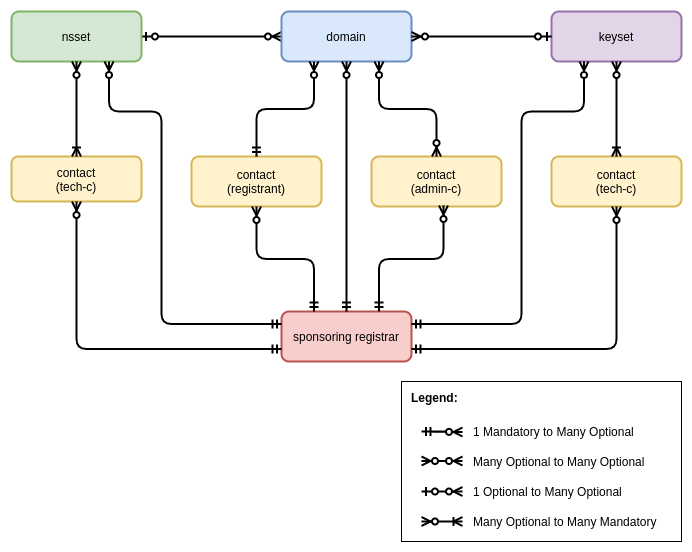

========================
mod_whoisd apache module
========================

This document describes mostly general capabilities of the whois server.
The rest of documentation must be generated by doxygen. To generate
documentation type "make doc" (assuming you have installed doxygen) and then
you can start browsing web docs at doc/html/index.html.

In documentation generated by doxygen, you can find:

* General description of mod_whoisd,
* Configuration description,
* Installation guide,
* Troubleshooting.

If you don't have installed doxygen tools or you don't want to install it
you can view the raw doxygen source file doc/mainpage.h.

The whois implementation conforms to RFC 3912 which only specifies the
on-the-wire protocol. Other documents which influenced our implementation are
RFC 954 and ripe database reference manual.

Whois service publishes information about the objects stored in the whois
database. There are several object types:

* domain
* nsset
* keyset
* contact
* registrar

An object is defined by its attributes. Attribute is a pair of name and value.

Output Format
=============

Comments begin with two characters at the beginning of line: '%' and a space.
Each response from server is prefixed by a disclaimer followed by
the server version and the current timestamp. All this is a part of the comment.

Each object record is a set of attributes, each attribute is on separate line.
The attribute's name and value are separated by colon which immediately follows
the name. Between the colon and the value, there may be unspecified number of
spaces. If an attribute has multiple values, it is repeated for each value.
Blank line denotes the end of object record. There may be more objects in one
server response if they are relevant to the user's query. End of each response
is marked by two blank lines. The maximal number of objects returned in one
response is limited.

If the server encounters a problem, an error message is returned as the query
result. The format of the error message is as follows:

``%ERROR:#:<message>``

where # is the error code and 'message' is a short description of the problem,
possibly followed by a more descriptive message, each line of which starts
with % followed by a white space and a text.

Object Templates
================

Here we define templates for the objects. Not all attributes of objects must be
present in an output. Some of them are optional and some attributes of the
contact object may be hidden as per registrant's decision. Domain template
is used for 'common domains' as well as for ENUM domains. For ENUM domains, the
attribute 'registrant' is never shown (for common domains, this attribute is
always shown) and the attribute validated-to is applicable only to ENUM domains.
The fourth column of templates marks the attributes that can be used for search.
A primary key unambiguously identifies the object within the scope of one object
type. An inverse key can be used to search for an object, while 'inverse'
implies the search goes from the bottom to the top of a tree representing
relationships among objects.

Domain template
---------------

+---------------+--------------+-------------+---------------+
+---------------+--------------+-------------+---------------+
| domain:       | [mandatory]  | [single]    | [primary key] |
+---------------+--------------+-------------+---------------+
| registrant:   | [optional]   | [single]    | [inverse key] |
+---------------+--------------+-------------+---------------+
| admin-c:      | [optional]   | [multiple]  | [inverse key] |
+---------------+--------------+-------------+---------------+
| temp-c:       | [optional]   | [multiple]  | [inverse key] |
+---------------+--------------+-------------+---------------+
| nsset:        | [optional]   | [single]    | [inverse key] |
+---------------+--------------+-------------+---------------+
| registrar:    | [mandatory]  | [single]    | [ ]           |
+---------------+--------------+-------------+---------------+
| status:       | [optional]   | [multiple]  | [ ]           |
+---------------+--------------+-------------+---------------+
| registered:   | [mandatory]  | [single]    | [ ]           |
+---------------+--------------+-------------+---------------+
| changed:      | [optional]   | [single]    | [ ]           |
+---------------+--------------+-------------+---------------+
| expire:       | [mandatory]  | [single]    | [ ]           |
+---------------+--------------+-------------+---------------+
| validated-to: | [optional]   | [single]    | [ ]           |
+---------------+--------------+-------------+---------------+

Nsset template
--------------

+---------------+--------------+-------------+---------------+
+---------------+--------------+-------------+---------------+
| nsset:        | [mandatory]  | [single]    | [primary key] |
+---------------+--------------+-------------+---------------+
| nserver:      | [mandatory]  | [multiple]  | [inverse key] |
+---------------+--------------+-------------+---------------+
| tech-c:       | [mandatory]  | [multiple]  | [inverse key] |
+---------------+--------------+-------------+---------------+
| registrar:    | [mandatory]  | [single]    | [ ]           |
+---------------+--------------+-------------+---------------+
| created:      | [mandatory]  | [single]    | [ ]           |
+---------------+--------------+-------------+---------------+
| changed:      | [optional]   | [single]    | [ ]           |
+---------------+--------------+-------------+---------------+

Keyset template
---------------

+---------------+--------------+-------------+---------------+
+---------------+--------------+-------------+---------------+
| keyset:       | [mandatory]  | [single]    | [primary key] |
+---------------+--------------+-------------+---------------+
| dnskey:       | [mandatory]  | [multiple]  |               |
+---------------+--------------+-------------+---------------+
| tech-c:       | [mandatory]  | [multiple]  | [inverse key] |
+---------------+--------------+-------------+---------------+
| registrar:    | [mandatory]  | [single]    |               |
+---------------+--------------+-------------+---------------+
| created:      | [mandatory]  | [single]    |               |
+---------------+--------------+-------------+---------------+
| changed:      | [optional]   | [single]    |               |
+---------------+--------------+-------------+---------------+

Contact template
----------------

+---------------+--------------+-------------+----------------+---------------+
+---------------+--------------+-------------+----------------+---------------+
| contact:      | [mandatory]  | [single]    | [primary key]  | [not hidable] |
+---------------+--------------+-------------+----------------+---------------+
| org:          | [optional]   | [single]    | [ ]            | [not hidable] |
+---------------+--------------+-------------+----------------+---------------+
| name:         | [mandatory]  | [single]    | [ ]            | [not hidable] |
+---------------+--------------+-------------+----------------+---------------+
| address:      | [mandatory]  | [multiple]  | [ ]            | [not hidable] |
+---------------+--------------+-------------+----------------+---------------+
| phone:        | [optional]   | [single]    | [ ]            | [hidable]     |
+---------------+--------------+-------------+----------------+---------------+
| fax-no:       | [optional]   | [single]    | [ ]            | [hidable]     |
+---------------+--------------+-------------+----------------+---------------+
| e-mail:       | [mandatory]  | [single]    | [ ]            | [hidable]     |
+---------------+--------------+-------------+----------------+---------------+
| registrar:    | [mandatory]  | [single]    | [ ]            | [not hidable] |
+---------------+--------------+-------------+----------------+---------------+
| created:      | [mandatory]  | [single]    | [ ]            | [not hidable] |
+---------------+--------------+-------------+----------------+---------------+
| changed:      | [optional]   | [single]    | [ ]            | [not hidable] |
+---------------+--------------+-------------+----------------+---------------+

Registrar template
------------------

+---------------+--------------+-------------+---------------+
+---------------+--------------+-------------+---------------+
| registrar:    | [mandatory]  | [single]    | [primary key] |
+---------------+--------------+-------------+---------------+
| org:          | [mandatory]  | [single]    | [ ]           |
+---------------+--------------+-------------+---------------+
| url:          | [mandatory]  | [single]    | [ ]           |
+---------------+--------------+-------------+---------------+
| phone:        | [optional]   | [single]    | [ ]           |
+---------------+--------------+-------------+---------------+
| address:      | [mandatory]  | [multiple]  | [ ]           |
+---------------+--------------+-------------+---------------+

Object relations schema
^^^^^^^^^^^^^^^^^^^^^^^

Registrant, admin-c and tech-c are all of the same type – a contact. The tree is
rooted at the domain object and the dependency links run from there to the
registrar. When displaying information about an object, all the objects
referenced in that object are displayed too and so on recursively. There is one
exception to this rule: the registrar object which is not displayed unless it is
a primary subject of a user's query. The next table summarizes the responses
returned for the given objects when asked for certain type of object by its
primary key.

domain
------

* 1 domain
* 1 registrant
* n admin-c objects
* 1 nsset (optional)
* n tech-c objects (only if there is nsset)

nsset
-----

* 1 nsset
* n tech-c objects

contact
-------

* 1 contact

registrar
---------

* 1 registrar

Flags and Options Accepted by Server
====================================

Usage:   whois [options] [[type] value]

If the server encounters an option that it does not understand, it prints
a help message which starts by comments and returns no data. The following
options are accepted by server – a small subset of options accepted by
RIPE whois server.

  -r            Switch off recursion. Only the object which is primary target
                of query is returned.
  -T type       Type of object to lookup (domain, nsset, contact, registrar).
                There may be more types separated by comma without spaces
                between them. The types are case-insensitive.
  -i attr       Lookup object by its attribute. Attribute can be any of
                attributes from object templates marked by flag "inverse key".
                Attribute name is case-insensitive.
  -q version    Returns version of whois server.
  -q indexes    Returns list of attributes which can be used in search. The
                attributes have form object:attribute.
  -q templates  Returns templates for all four object types.

There's one more way to specify a type of an object to be looked up. Just
prepend the object's identifier to the name of a type. The following two
examples have the same meaning:

 ``$ whois -T domain nic.cz``

 ``$ whois "domain nic.cz"``

The -q parameter can be used only once and not in combination with any other
option. The -i parameter can be used only once.

Error Codes
===========

Here is a list of possible error codes accompanied by their description.
We tried to stay compatible with RIPE DB error codes where possible.

.. code-block::

   %ERROR:101: no entries found
   %
   % No entries found.

.. code-block::

   %ERROR:107: usage error
   %
   % Unknown option, invalid combination of options or invalid value for option
   % was specified.

.. code-block::

   %ERROR:108: invalid request
   %
   % Invalid character in request, request not properly terminated or too long.

.. code-block::

   %ERROR:201: access denied
   %
   % Access from the host has been permanently denied because of excessive
   % querying.

.. code-block::

   %ERROR:501: internal server error
   %
   % Query didn't succeed becauseof server-side error. Please try again later.

Questions and Answers
=====================

.. topic:: Q: Does the whois server support wildcard search?

   A: No, the wildcard symbols are handled as any other characters.

.. topic:: Q: Does the whois server support persistent connections?

   A: No, one connection = one query.

.. topic:: Q: Do you provide your own implementation of whois client?

   A: No, but existing implementations can be easily used if you take care of quoting of switches, which are not known to the client.

.. topic:: Q: Is your server compatible with RIPE whois?

   A: No, but we tried to stay compatible where possible. Generally we implement
   only a subset of switches and options implemented by RIPE server. If you
   use an option which the RIPE server understands, but our doesn't, the
   server returns an error and help message.
